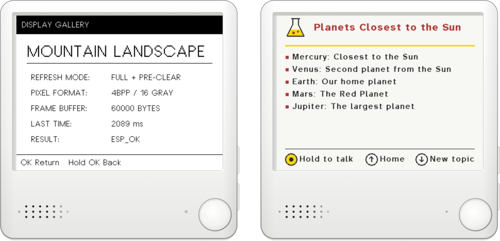
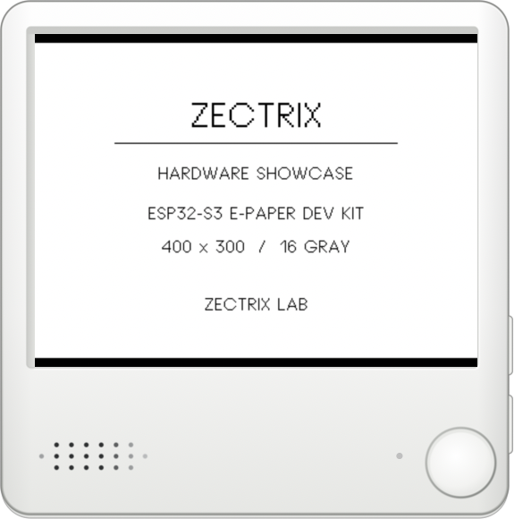
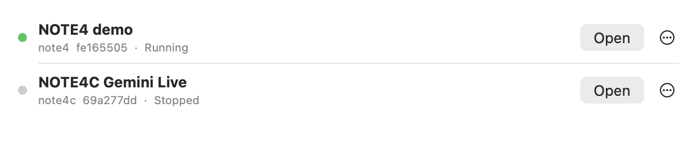
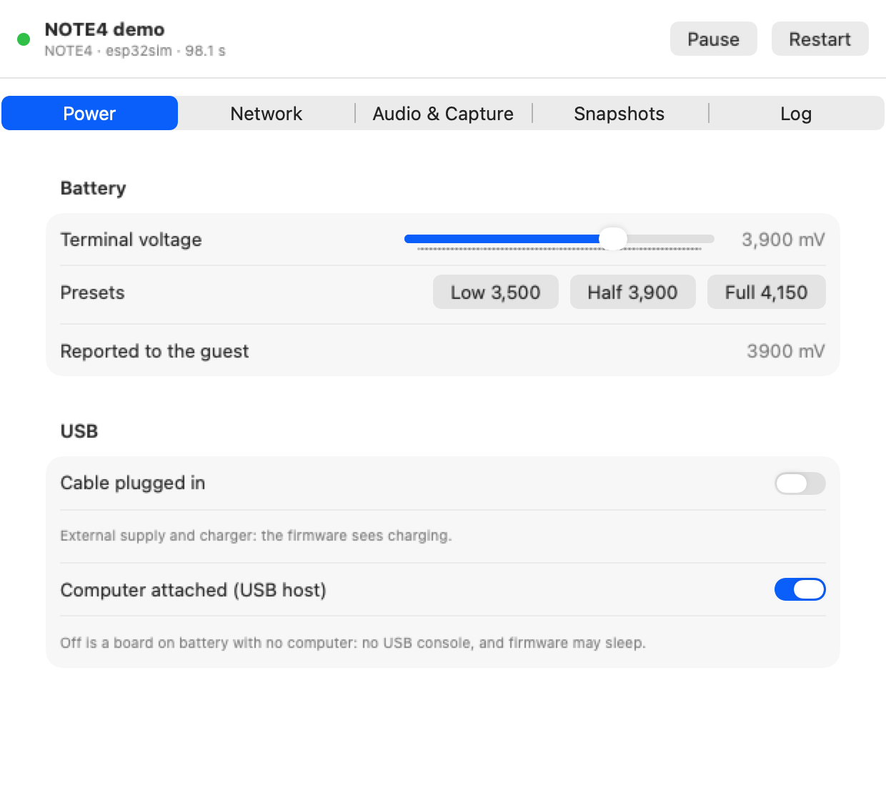

# NOTE Emulator

An emulator for the Zectrix **NOTE4C** (four-colour e-paper) and **NOTE4** (black-and-white,
partial refresh, 16-level gray) ESP32-S3 devices, in the spirit of the Android Emulator and the
iOS Simulator. It runs **unmodified firmware** on a Rust engine (a fork of
[esp32sim](https://github.com/joakimeriksson/esp32sim)), with a native macOS app, a headless
`note-emu` host per device and an `adb`-like `ndb` tool.

An independent project: not affiliated with or endorsed by Zectrix. NOTE4 and NOTE4C are their
products, and the device shells are drawn from their product photos.

<p align="center">
  
</p>

> A personal developer tool for Apple Silicon Macs (macOS 15 or later).
> [Download the signed and notarized app](https://github.com/omercelik/note-emulator/releases/latest),
> or build it from source (see [Try it](#try-it)).

## Try it

Download the macOS arm64 DMG from [Releases](https://github.com/omercelik/note-emulator/releases/latest),
open it, and drag **NOTE Emulator.app** to Applications. Open the app, then choose Add the NOTE4
demo or Add NOTE4C emini Home, then Open. The ROM and both demo firmwares are included.
Add Bundled Device in the toolbar lets you add either later.

The NOTE4C sample is [emini Home v0.6.2](https://github.com/fiedoruk/emini-home/releases/tag/v0.6.2),
an English-first weather, headlines, and notes app. It opens at the addresses it shows on its screen, which needs the network helper: install it from Controls → Network (macOS asks once for an administrator password). Until then it uses a local address.
On first boot, enter the hotspot password shown on its screen in Controls → Network → Emulator
access point at the top of the Network tab. It is visible; click Connect to apply it and check that the setup page responds. Open the browser URL there and pair with the code on the screen. The password
must be entered again after the device stops. Once emini joins Wi-Fi it shows its own address,
`http://10.0.2.15/`; that opens on this Mac too. This is community firmware, not a factory image.

The default simulated Wi-Fi is **esp32sim**, protected with WPA2 password **12345678**.
Use these credentials in the firmware's Wi-Fi setup page.

For firmware joining a Wi-Fi network, expand **Simulated Wi-Fi network** in Controls → Network
and enter the Wi-Fi name and password directly. Save applies at the next device start;
importing a `.env` file is optional. These settings belong to the simulated access point,
separately from the firmware's setup-hotspot password.

To build from source:

Needs Rust 1.92 and Xcode 27 (Swift 6.4). The ESP32-S3 mask ROM (Espressif, Apache-2.0) and
the [NOTE4 reference demo](https://github.com/itopinion/zectrix-note4-epd-demo) firmware (MIT)
are included, so this is all:

```sh
git clone https://github.com/omercelik/note-emulator && cd note-emulator
scripts/bundle-app.sh && open "dist/NOTE Emulator.app"   # then: Add the NOTE4 demo, Open
```

For the command-line tools, `cargo build --release --workspace` and add `target/release` to
your `PATH`.

A device here is an **AVD** (the Android Emulator's term): a firmware image plus its own flash,
settings and saved state, kept under `~/Library/Application Support/NOTE Emulator`.

## What works

<table>
  <tr>
    <td align="center"></td>
    <td align="center"></td>
  </tr>
  <tr>
    <td align="center"><sub>NOTE4 demo: power-on, menu, partial refresh, 16-gray gallery</sub></td>
    <td align="center"><sub>NOTE4C, Gemini Live client: hold to talk (LED lit), Gemini pins a card</sub></td>
  </tr>
</table>

- **Both devices, real firmware:** the NOTE4C factory firmware, the
  [NOTE4 reference demo](https://github.com/itopinion/zectrix-note4-epd-demo), and several
  community apps (Wi-Fi setup portals, an "is it Friday?" day display, a Gemini Live voice
  client) boot and run
  unmodified.
- **Display:** the four-colour and 16-gray panels, including partial refresh, drawn in a
  device-shaped window with clickable buttons and the green status LED.
- **Wi-Fi and internet:** a virtual access point (its name and password can match your home
  network), DHCP/DNS, NAT with TLS, and the firmware's own SoftAP setup pages from a browser on
  this Mac (`http://127.0.0.1:8080/`, or the real `http://192.168.4.1/` through a small root
  helper you install from Controls → Network). With that helper, the address a device shows
  once it is on Wi-Fi, `http://10.0.2.15/`, opens too (a switch in the same place). Installing
  asks for an administrator password once, and again only when an update changes the helper;
  starting a device never asks.
- **Audio:** the speaker plays on the Mac; the Mac's microphone (or a WAV file) feeds the
  device's microphone.
- **Power and board:** battery level, USB cable, RTC, light and deep sleep, the power latch.
- **State:** closing a device saves its full state; opening it resumes exactly there.
  Cold boot, restart and erase are one click each.
- **Developer tools:** GDB, `esptool` / `idf.py flash` and `idf.py monitor` over RFC 2217,
  symbolized panics, core dumps, screenshots, GIF/MP4 recording, logcat.

Not modelled: NFC (the factory NFC step reports unsupported). Not built: shared (vmnet)
networking, so a device is reachable from this Mac but not from other machines on your LAN.

## Using the app

On first run the app imports the bundled ESP32-S3 mask ROM (checked against its known
SHA-256). An empty device list offers the NOTE4 reference demo and NOTE4C emini Home.

<p align="center">
  
</p>

- **New AVD…** imports a firmware (a merged 16 MB image or an ESP-IDF build directory) for a
  NOTE4 or NOTE4C.
- **Open** turns a device on where it left off and shows its window. **Closing the window turns
  it off**, saving its state. Quitting the app does the same for every device it started.
- **⋯** on a device row: Cold Boot (start fresh, keep settings), Controls…, Turn Off,
  Erase Content and Settings… (factory reset), Delete Device… (permanently removes a stopped
  device and all its saved data), Show in Finder.
- **In the device window:** click the drawn buttons or use ↑ ↓ ⏎; drag the device to move the
  window; hover for the window buttons and a small bar (Controls, Screenshot, Rotate). The Device
  menu has Restart (⇧⌘R), snapshots, zoom, rotation, recording and mute.
- **Controls** (⇧⌘K): Power (battery, USB), Network (mode at start, Wi-Fi credentials, browser
  URL), Audio & Capture (speaker, microphone, screenshot, recording), Snapshots, Log. For a device
  that is off, it shows what can be set offline.

<p align="center">
  
</p>

- **Microphone:** on by default per device. macOS asks for permission the first time a
  device's firmware starts listening.

Devices started from the command line (`note-emu --avd`) appear as "Running outside the app";
closing their window only detaches it.

## Running your own firmware

```sh
# A merged image from an ESP-IDF or esp-idf-rs build (16 MB, DIO, the project's partition table):
espflash save-image --chip esp32s3 --merge --flash-size 16mb --flash-mode dio --flash-freq 80mhz \
  --bootloader <bootloader.bin> --partition-table <partitions.csv> --partition-table-offset 0x8000 \
  <app.elf> firmware.bin
ndb avd create --profile note4c --firmware firmware.bin --name "My app"   # or an IDF build dir

# Firmware with your home Wi-Fi compiled in: let the virtual AP use the same name and password.
# Only the file's path is stored; the file must be mode 0600 (WIFI_SSID, WIFI_PASSWORD).
ndb avd wifi <id> --env ~/path/to/project/.env
ndb avd network <id> user          # internet through NAT (disabled | user | setup | shared)

ndb -s <id> install <build-dir|merged.bin>   # update a stopped AVD's app, keep NVS
```

Then Open it in the app, or run it headless with `note-emu --avd <id> --seconds 0 --quick-boot`.

## Command line

```sh
note-emu --avd <id> --seconds 0 --realtime --quick-boot   # what the app runs; 0 = until stopped
note-emu --avd <id> --quick-boot --cold-boot              # start fresh, still save at stop
ndb devices                                   # AVDs; `ndb avd list|create|wipe|delete|network|wifi`
ndb -s <id> status | stop | screenshot -o f.png | press ok|up|down [--hold ms]
ndb -s <id> battery <mV> | usb --cable on|off | mic <16kHz-mono.wav> | logcat
ndb -s <id> snapshot save|load|list|delete [NAME]
ndb -s <id> serial-url | flash <build-dir> | gdb --elf app.elf --run | coredump -o core.bin

# Headless, without an AVD: raw console and one PNG per panel refresh in --out
note-emu --profile note4 --firmware third_party/zectrix-note4-epd-demo/zectrix-note4-epd-demo-v1.0.0.bin \
  --seconds 12 --out /tmp/note4 --press 4:down --press 6:ok
```

`NOTE_EMU_HOME` moves the data directory (default `~/Library/Application Support/NOTE Emulator`).
More flags: `note-emu --help`, `ndb help <command>`.

## Building and testing

```sh
ndb doctor                                 # checks the ROM, tools and profiles
scripts/verify.sh                          # build + Rust and Swift unit tests
scripts/verify.sh --engine --firmware --dev --package   # every automated check (~15 min)
scripts/bundle-app.sh                      # dist/NOTE Emulator.app (ad-hoc signed, ROM + demo included)
scripts/readme-media.sh                    # regenerate docs/media from live devices
```

The README images are the app's own views, rendered from live devices by `scripts/readme-media.sh`
(the NOTE4C animation is optional and needs a Gemini Live firmware image). Some firmware
regression tests use private firmware images from `.tools/private` (or `NOTE_PRIVATE_DIR`); they
skip when those are absent.

## Layout

| Path | Contents |
|---|---|
| `engine/esp32sim/` | vendored engine at `4ab7e90`; every change is in `PATCHES.md` with its test |
| `crates/` | `note-core` (profiles, ROM store), `note-protocol` (wire format), `note-machine` (board, panels, snapshots), `note-runtime` (AVD store, protocol server, logs, network) |
| `apps/` | `note-emu` (one device), `ndb` (CLI), `note-net-helper` (root helper for `192.168.4.1` and `10.0.2.15`) |
| `macos/` | the SwiftUI app and the Swift protocol client |
| `Profiles/` | `note4c.json`, `note4.json` and the vector shell `skins/note-shell.svg` |
| `reference/` | board wiring, design decisions, firmware compatibility report |
| `docs/` | the control protocol spec and the README images |
| `scripts/` | verify, bundle, fixtures, helper install and checks |

Private firmware images, flash dumps and `.env` files are never committed. A firmware built with
credentials compiled in keeps them in its AVD's flash, under your data directory.
